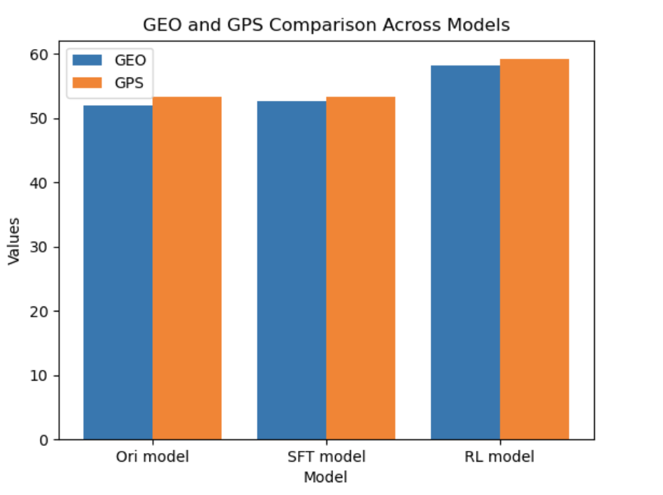

# R1-Multimodal-Journey

**Environment**

- Follow the instruction in https://github.com/FanqingM/R1-Multimodal-Journey
- Update the transformers to the 4.49.0.dev0 to support the Qwen2.5_VL
- `pip install vllm == 0.7.2 trl == 0.15.0.dev0` to support vLLM

**What we did**

- Fix some bugs in [Open-R1-Multimodal](https://github.com/EvolvingLMMs-Lab/open-r1-multimodal) (such as function: get_per_token_logps)
- Suppoprt vLLM to make the training process more faster (5-6x faster then OpenR1-MM)
- Exploring the effectiveness of R1-like reinforcement learning (RL) on more challenging problems (geometry problems).
  - We use 20k samples from geo170k for now

**Some Findings**

-  The "aha moment" can emerge even at the very beginning of training, even for a model as small as 3B and in the instruct model setting.

  Here is a sample when we just training within 10 steps

  ```
  Content: <think> In the second quadrant, the x-coordinate is negative and the y-coordinate is positive. The cosine of an angle in a right triangle is equal to the adjacent side over the hypotenuse. Since the cosine of $\alpha$ is $-\frac{3}{5}$, we can determine that the adjacent side (which is the x-coordinate) is $-3$ (since the hypotenuse is 1 for the unit circle). The hypotenuse is always 1, so the radius of the circle is 1. Using the Pythagorean theorem, we can find the y-coordinate (the opposite side), which is $y = \sqrt{1^2 - (-3)^2} = \sqrt{1 - 9} = \sqrt{-8}$. 
  *****This gives us a complex number, indicating that there was a mistake in the initial assumption that we could solve for the y-coordinate directly from the cosine value without considering the unit circle and the quadrant.*****
  Since $\cos \alpha = -\frac{3}{5}$ in the second quadrant, and knowing that $\cos^2 \alpha + \sin^2 \alpha = 1$, we can find $\sin \alpha$. $\sin \alpha = \sqrt{1 - \cos^2 \alpha} = \sqrt{1 - (-\frac{3}{5})^2} = \sqrt{1 - \frac{9}{25}} = \sqrt{\frac{16}{25}} = \frac{4}{5}$. Therefore, the coordinates of point A are $(-\frac{3}{5}, \frac{4}{5})$. </think><answer> The coordinates of point $A$ are $(-\frac{3}{5}, \frac{4}{5})$.
  
  ```

- VLMs seem to struggle to exhibit length increase patterns similar to LLMs. In our experiments, we tested various datasets but failed to replicate the length increase curve observed in (simpleRL-reason)[https://github.com/hkust-nlp/simpleRL-reason]. However, performance improvements were indeed observed through evaluation.

- Although R1's RL only provides rewards based on answer correctness, it still demonstrates higher data efficiency compared to SFT.  We compared the results on the mathvista-testmini set.

  

- We believe that the reason why VLM is difficult to achieve an R1 moment similar to LLM is the lack of high-quality data. Currently, multimodal reasoning data is significantly scarcer than language data. This makes it difficult for the model to show length growth on simple datasets such as geo170k, and it is easy to overfit.

  

- We found that the slow speed of Openr1-Multimodel was due to slow generation, causing other processes to wait. To address this, we replaced it with vLLM, significantly reducing training time (in 8H100 on 20k Geo170k samples).

  

**Data Preparation**

- Modify necessary input/output paths in **local_scripts/gen_dataset.py**
- Prepare the dataset using **python local_scripts/gen_dataset.py**(unlike [Open-R1-Multimodal](https://github.com/EvolvingLMMs-Lab/open-r1-multimodal) that directly store the image in PIL format, we store image path(url or local path) to enable vLLM support)

**Training**

- Modify necessary input/output paths in **local_scripts/train_qwen2_5_3b.sh**
- sh local_scripts/train_qwen2_5_3b.sh
  - The default setting for vLLM uses `cuda:7` for generation while utilizing the remaining 7 nodes for training.

**Evaluation**

- run **python eval/evaluate_mathvista.py --checkpoint ${CHECKPOINT} --datasets MathVista_testmini** to evaluate your ckpt on MathVista_testmini.

**Acknowledgement**

Our codebase builds upon [Open-R1-Multimodal](https://github.com/EvolvingLMMs-Lab/open-r1-multimodal) and integrates open-source contributions from [vLLM](https://github.com/vllm-project/vllm), [Open-R1](https://github.com/huggingface/open-r1), and [trl](https://github.com/huggingface/trl). We also extend our gratitude to [DeepSeek-R1](https://github.com/deepseek-ai/DeepSeek-R1) and [Qwen2.5-VL](https://github.com/QwenLM/Qwen2.5-VL) for their open-source techniques and base models, which have enabled us to further our exploration.


**Core Contributors (equal contribution with Alphabetical sorting)**

Lingxiao Du, Xiangyan Liu, Fanqing Meng.

**Hiring Announcement**

We are hiring interns at the Shanghai AI Lab, with a focus on multi-modality reasoning model. If you are interested, please contact weqish@gmail.com.
